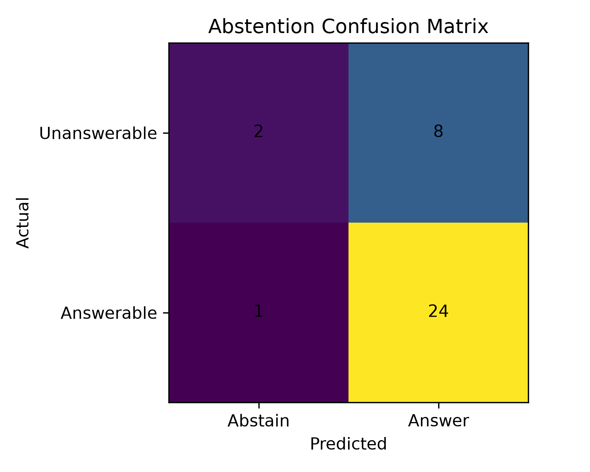
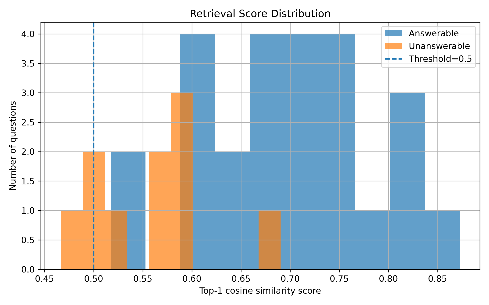
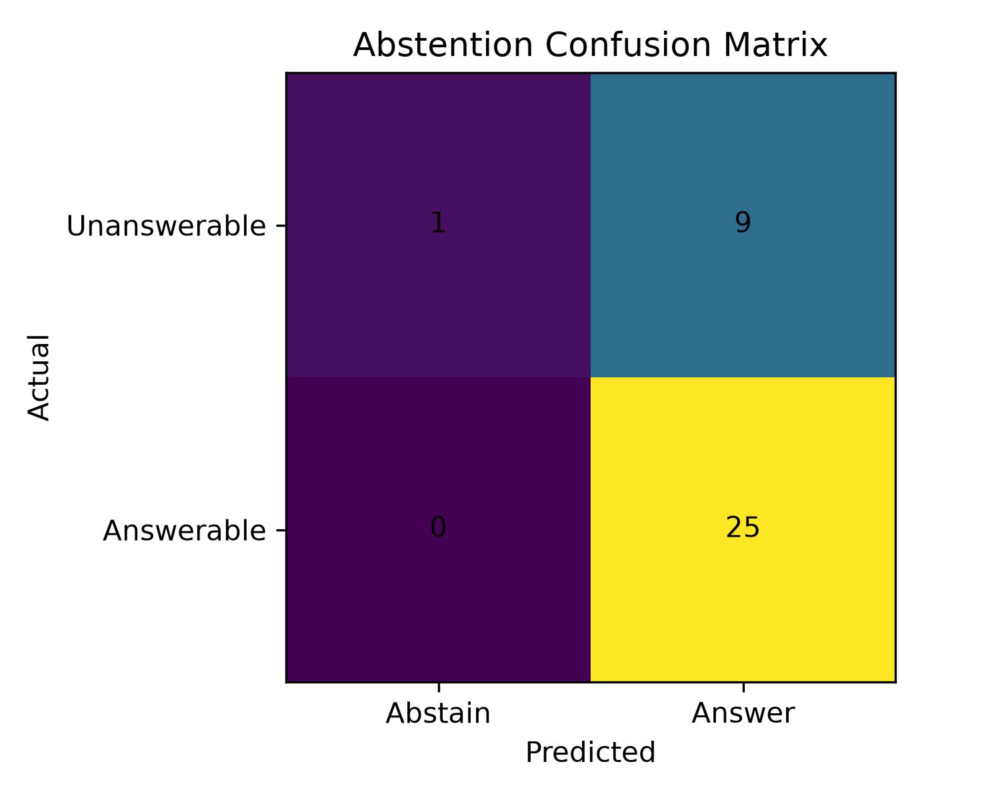

# Diagnosing

## Run the baseline

After running the baseline, it shows that the baseline does not support unanswerable questions about docs and also retrieves the whole document even when only a specific answer is needed. The first step is to add support for unanswerable questions for that just add some treshholds first, and then improve chunking so the system can return answers that are more specifically relevant to the question. also its require to add eval dataset i use glm-5.2 to create eval dataset.

After adding threshold 5 for the baseline and evaluating on data, it shows that the main problem is when the question is unanswerable but the model returns an answer to it, resulting in false positives. As shown in the score distribution plot, there is no threshold that can well separate the answer.

i think the problem is that the chunk contexts arent specific and are very general so every query that point a little to that even unrelated can have answer.

I use sentence chunking strategy and as at now the retrevel is important i eval that the doc_id be the same as the ground truth doc_id (not createing seprate label for each sentences) and the result shows that the recal@1  and recal@3 imporved by 3% but min scores of unanswerable samples goes up by ~0.1 by threshold 0.5 the plots like this:

  
simply adding title to each chunk boost the scores of TP samples now with treshholds ~0.7 the unanswerable questions approximatly seprated as shows in plot of scores distribution.

as results shows in below images the bm25 term-based search algo also works good on our data for answerable questions but using bm25 seprately can catch the unanswerable questions so next step is use bm25 as retirever and sematic retreiver as reranker as the recal@3 of bm25 is 100% we can ensure in top-5 result of it there is gold doc and it can boost the scores. also i added build_time and retrieval speed time mesuring.