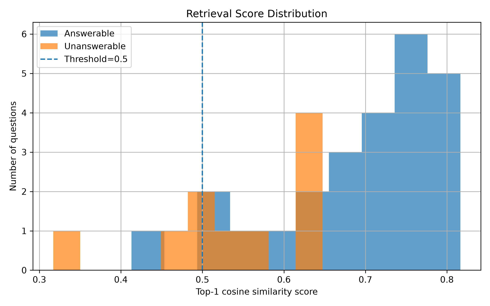
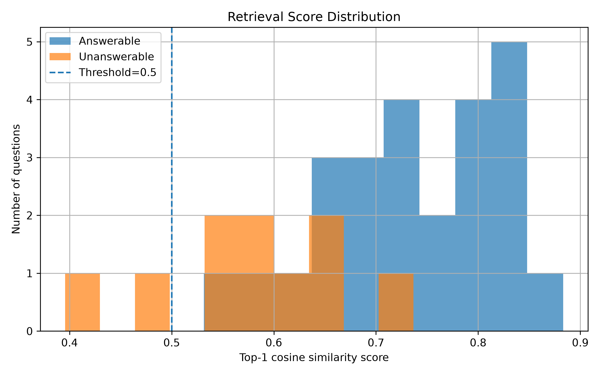
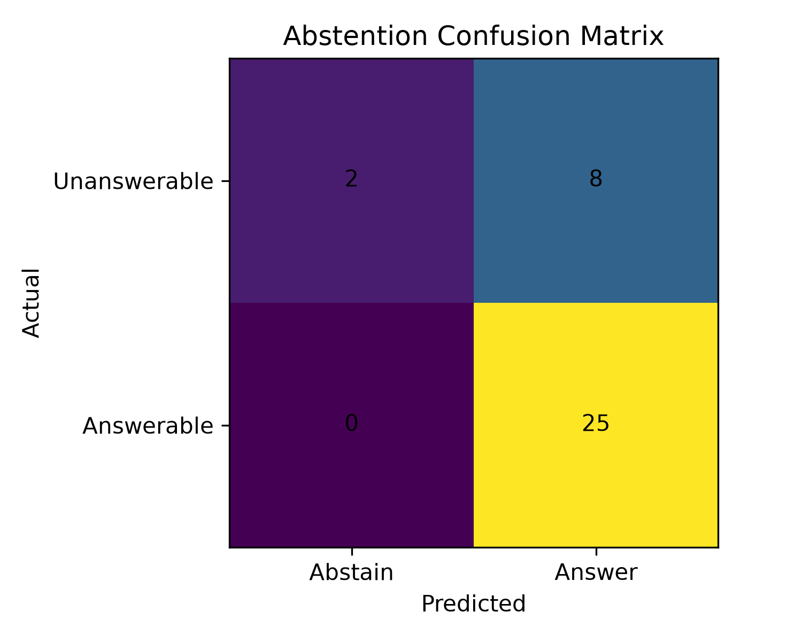
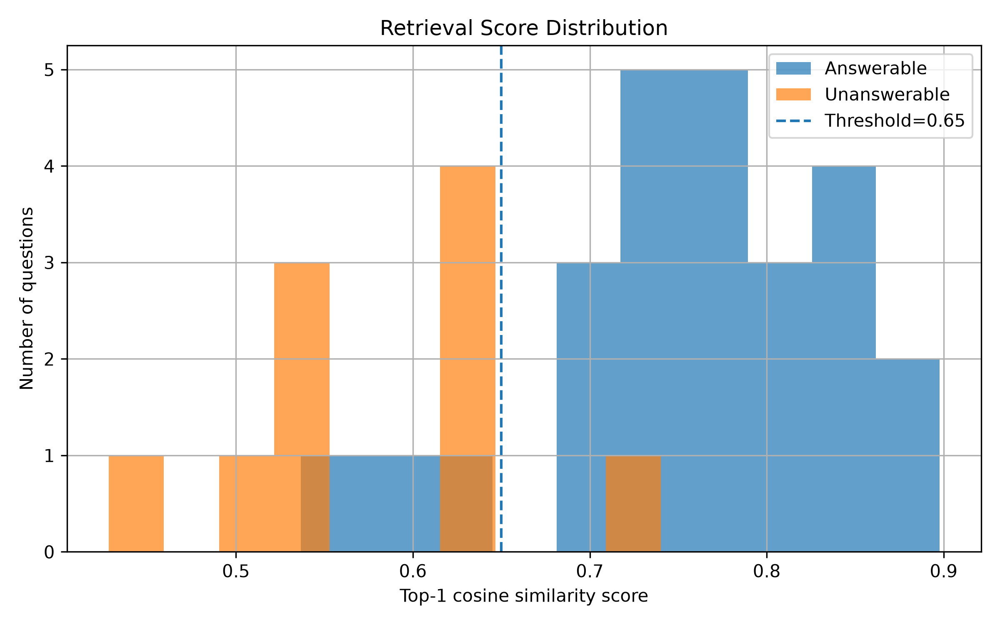
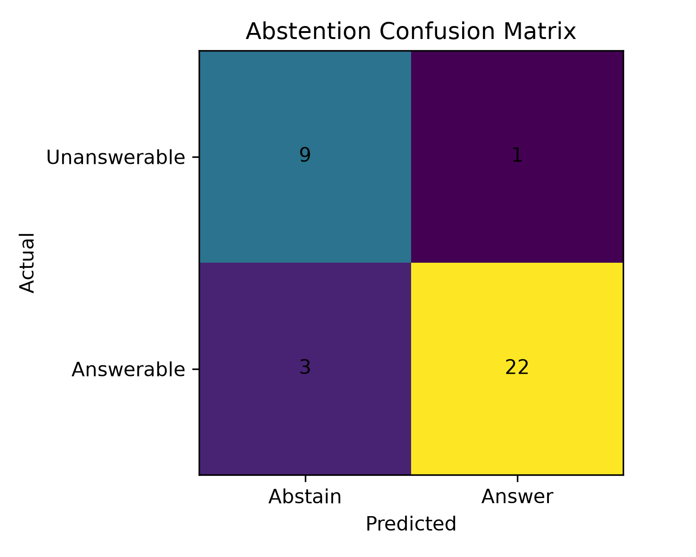

# Pipeline Diagnostics & Optimization Log

## 1. Running the Baseline

After running the baseline, the results show that the baseline does not support unanswerable questions and retrieves the entire document even when only a specific answer is needed. 

### Initial Goals:
* Add support for unanswerable questions by introducing similarity thresholds.
* Improve chunking so the system can return answers that are more specifically relevant to the query.
* Generate an evaluation dataset (created using **GLM-5.2**).

After adding a threshold of `0.5` to the baseline and evaluating, the main issue identified is when a question is unanswerable but the model returns a document anyway, resulting in false positives. As shown in the score distribution plot below, there is no single threshold that can cleanly separate answerable and unanswerable queries.




> **Diagnostic Hypothesis:** The chunk contexts are too general and lack specificity. Consequently, any query that points even slightly toward the general topic receives a high similarity score, even if it is unrelated.

---

## 2. Sentence Chunking Strategy

To address the context specificity issue, we implemented a sentence chunking strategy. During evaluation, we mapped the retrieved sentences back to their parent document IDs (`doc_id`) to match the ground truth.

### Key Results:
* **Recall@1 and Recall@3** improved by **3%**.
* The minimum similarity scores of unanswerable samples increased by approximately `0.1`.

Below are the distribution and confusion matrix plots for this experiment:


---

## 3. Metadata Enrichment: Sentence Chunking with Titles

Simply prefixing the document title to each sentence chunk boosted the similarity scores of the True Positive (TP) samples. With this modification and a threshold of approximately `0.7`, unanswerable questions can be approximately separated from answerable ones.


---

## 4. Term-Based Search (BM25) & Reranking Trials

The term-based BM25 search algorithm performed well on our data for answerable questions. Because the **Recall@3 of BM25 reached 100%**, we can be confident that the correct document is within the top-5 results.

### Latency Profiling:
To monitor operational efficiency across different retrieval setups, we integrated execution time tracking to measure both:
* **Index Construction Speed (`build_time`)**
* **Query Execution/Retrieval Latency**

### Reranking Implementation:
We implemented a two-stage reranker:
1. Retrieve the top 8 candidate documents using BM25.
2. Rerank the sentence chunks within those 8 documents using cosine similarity of their embeddings.

**Result:** No significant performance improvement was observed. 

> **Design Decision:** Moving to hybrid search methods like Reciprocal Rank Fusion (RRF) may not be the best choice here, as they have little impact on filtering out unanswerable questions (though they might provide minor improvements on error-code queries). Instead, we prefer focusing on improving context using metadata and semantic search alone.

---

## 5. Duplicate and Conflict Detection

We created a diagnostic notebook, `near_duplicate.ipynb`, to run similarity checks across all sentence embeddings. Pairs with a **cosine similarity score higher than 0.8** were flagged as potential duplicates or logical contradictions:

* **Knowledge Conflicts:** Identified between `DOC-02_s_2` (referencing a pressure of 16) and `DOC-01_s_2` (referencing a pressure of 12).
  * *Resolution:* We dropped the sentence containing the  **16** value and preserved the sentence specifying **12** (since its maximum pressure specification lower is better).
* **Knowledge Duplication:** Identified between `DOC-05_s_0` and `DOC-06_s_0`.
  * *Resolution:* We removed the **less context-rich** sentence chunk to preserve data richness while eliminating redundant vectors from the index.

---

## 6. Sliding Window Chunking Experiment

We implemented sliding window chunking and tested it under both pure semantic search and the hybrid reranking setup.

### Findings:
* For pure semantic search, sentence-level chunking still yields better overall separation.
* For the reranking pipeline, the sliding window approach performs better on answerable queries.




---

## 7. Threshold Calibration & Generalizability Validation

After testing different thresholds and sliding window parameters, the semantic retriever alone configured with a threshold of `0.65` achieved **85% accuracy** on our validation dataset. 

Here are the validation calibration plots:




To test the generalizability of this model, we evaluated it against an unseen test dataset of 100 samples created using **Gemini Flash 3.5**.

### Generalizability Results:
* **Accuracy on unseen test samples:** Dropped to **65%**.
* **BM25 performance on test set:** For only answerable questions within the test dataset, BM25 demonstrated solid performance with an **88.88% Hit@1**. This indicates that hybrid search combined with a dynamic (rather than static) threshold holds potential for practical deployments.
* **Conclusion:** On unseen data, the semantic retriever with a static `0.65` threshold struggles to make correct decisions. This demonstrates that a single fixed threshold is highly vulnerable to distribution shifts and cannot cleanly separate unanswerable questions on unseen data.

---

## 8. Quantitative Evaluation Summary

The following table provides a consolidation of metrics obtained from validating the different pipeline configurations under varying thresholds:

| System / Setting | Dataset | Threshold | Hit-Rate@1 | Hit-Rate@3 | MRR | Abstention | Fabrication | Accuracy | Latency |
| :--- | :---: | :---: | :---: | :---: | :---: | :---: | :---: | :---: | :---: |
| **BM25** | Eval | 0.00 | 92.0% | 100.0% | 0.960 | 0.0% | 100.0% | 65.7% | 0.05 ms |
| **BM25** | Test | 0.00 | 88.9% | 94.4% | 0.927 | 0.0% | 100.0% | 80.0% | 0.09 ms |
| **RETRIEVER** | Eval | 0.50 | 96.0% | 100.0% | 0.980 | 10.0% | 90.0% | 71.4% | 13.19 ms |
| **RETRIEVER** | Eval | 0.65 | 84.0% | 88.0% | 0.860 | 90.0% | 10.0% | 85.7% | 13.69 ms |
| **RETRIEVER** | Test | 0.50 | 88.9% | 95.6% | 0.922 | 10.0% | 90.0% | 81.0% | 14.59 ms |
| **RETRIEVER** | Test | 0.65 | 65.6% | 70.0% | 0.678 | 60.0% | 40.0% | 65.0% | 14.67 ms |
| **RETRIEVER (Sliding Window)** | Eval | 0.50 | 96.0% | 100.0% | 0.980 | 20.0% | 80.0% | 74.3% | 13.59 ms |
| **RETRIEVER (Sliding Window)** | Eval | 0.65 | 80.0% | 80.0% | 0.800 | 80.0% | 20.0% | 80.0% | 13.67 ms |
| **RETRIEVER (Sliding Window)** | Test | 0.50 | 90.0% | 93.3% | 0.915 | 10.0% | 90.0% | 82.0% | 14.82 ms |
| **RETRIEVER (Sliding Window)** | Test | 0.65 | 63.3% | 64.4% | 0.639 | 60.0% | 40.0% | 63.0% | 14.87 ms |
| **RERANKER** | Eval | 0.50 | 96.0% | 100.0% | 0.980 | 10.0% | 90.0% | 71.4% | 13.38 ms |
| **RERANKER** | Eval | 0.65 | 84.0% | 88.0% | 0.860 | 90.0% | 10.0% | 85.7% | 14.01 ms |
| **RERANKER** | Test | 0.50 | 88.9% | 95.6% | 0.922 | 10.0% | 90.0% | 81.0% | 14.66 ms |
| **RERANKER** | Test | 0.65 | 65.6% | 70.0% | 0.678 | 60.0% | 40.0% | 65.0% | 14.93 ms |
| **RERANKER (Sliding Window)** | Eval | 0.50 | 100.0% | 100.0% | 1.000 | 20.0% | 80.0% | 77.1% | 16.55 ms |
| **RERANKER (Sliding Window)** | Eval | 0.65 | 80.0% | 80.0% | 0.800 | 80.0% | 20.0% | 80.0% | 16.32 ms |
| **RERANKER (Sliding Window)** | Test | 0.50 | 90.0% | 92.2% | 0.911 | 10.0% | 90.0% | 82.0% | 17.41 ms |
| **RERANKER (Sliding Window)** | Test | 0.65 | 63.3% | 64.4% | 0.639 | 60.0% | 40.0% | 63.0% | 16.71 ms |

---

## 9. How to Reproduce Results

To run the benchmarking pipeline and compile all metric reports:

1. Install the required PDF generation dependencies:
   ```bash
   pip install reportlab

2. Run the evaluation master script from your project directory:
   ```bash
   python src/evall_all.py

## 10. AI Usage

This project utilized artificial intelligence models to assist with code structure, evaluation data generation, and documentation polishing:

1. **GLM-5.2 (Code Assistance):** Assisted in drafting the initial baseline version of the evaluation harness (`evaluate.py`), which originally only supported semantic retriever evaluations. We subsequently modified and extended this harness to measure index construction speed (`build_time`), compute BM25 matrices, and implement two-stage hybrid reranker mechanics.
2. **GLM-5.2 (Evaluation Dataset):** Generated the synthetic evaluation dataset used during the initial validation and similarity threshold trials.
3. **Gemini Flash (Test Dataset):** Generated the 100-sample unseen generalizability test dataset.
4. **Gemini Flash (Documentation):** Assisted in organizing and polishing the raw diagnostic notes into this structured `README.md` layout. This conversion was strictly bounded to ensure only English grammar, typographical errors, formatting clarity, and descriptive headings were adjusted, retaining the original progress and methodology preserved in previous git commits.

as the system cannot generalize on test set and also bm25 have good accuracy on answerable questions i want to add rule base system and define some treshhold and parameters that fit on validation set and then eval it on test set.
i design rule that identify terms like p-200,e-207,brg-4410,dn65 in query and if find them use bm25 to score them and if it cant find any identifier use semantic search and if it find then find the highest rank doc using bm25 and then remove stopwords like: "what", "which", "how", "when", "where", "who", "why" and so on the query have just the important keywords and check the coverage of these query keywords with topdoc words if the covarage is more than treshhold it use bm25 for returing the top docs and else it use semantic as bm25 is good at findings keywords like eorr codes it increase the accuracy of semantic search alone that was ~85% to 91% with treshholds 0.5 for coverage and 0.65 for unswerable on validation dataset before this i have also use to query rewriting to when the bm25 score is low than treshold and coverage is low add text to query like " The exact identifier may not exist. Find the closest relevant document." so semantic can better determine the unaswerables but that didnt work and have lower accuracy than baseline semantic search. here are two confusion matrix of best semantic only and this rule base method:

rule base: results\validation\rulebased_bm25_covrage\confusion_matrix.png

semantic only : results\validation\retriever_t6_5\confusion_matrix.png