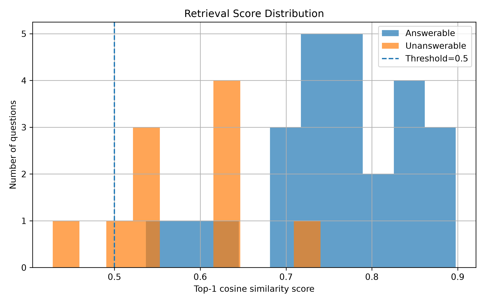

# RAG Retrieval Pipeline: Diagnostics & Optimization

This document outlines the diagnostic steps, structural improvements, and evaluation results for the RAG retrieval pipeline. The goal is to address document-level extraction challenges, isolate unanswerable queries, handle data duplication/conflicts, and calibrate retrieval thresholds for production generalizability.

---

## 1. Baseline Assessment & Challenges

The initial baseline retrieval system suffered from two primary design limitations:
1. **Lack of support for unanswerable queries**: The system always returned a document, even when the query was out-of-domain or unanswerable, leading to high false-positive rates.
2. **Coarse-grained retrieval**: The system retrieved entire documents instead of extracting targeted, specific passages relevant to the query.

To establish a diagnostic benchmark, an evaluation dataset was generated using GLM-5.2. 

### Threshold Calibration Trial
An initial baseline evaluation was conducted by applying a static similarity threshold of `0.5`. The distribution of similarity scores revealed a major issue: similarity scores for answerable and unanswerable queries overlapped significantly. As a result, no single threshold could effectively isolate unanswerable questions without causing high rates of false positives or false negatives.

This overlap occurred because whole-document contexts are highly generalized. Even an unrelated or out-of-domain query can yield a high cosine similarity score when matched against a broad, multi-topic document.

---

## 2. Sentence-Level Chunking & Context Enhancement

To improve specificity, the retrieval unit was shifted from whole documents to individual sentences. 

### Sentence Chunking
Evaluating the system with sentence-level chunks (while mapping retrieved sentences back to their parent document IDs) yielded a **3% improvement in Recall@1 and Recall@3**. 

However, the minimum similarity scores for unanswerable queries also shifted upward by approximately `0.1`, keeping the overall overlap high.

### Metadata Integration (Title Prefixing)
To reinforce context without losing specificity, the parent document title was prefixed to each sentence chunk. 

This adjustment boosted the similarity scores of True Positive (answerable) samples. By elevating the scores of valid matches, a clear separation emerged. Applying a threshold of approximately `0.7` separated answerable and unanswerable queries with far fewer false positives.

---

## 3. Hybrid Retrieval & Reranking Experiments

Term-based search (BM25) proved highly effective for keyword-focused, answerable queries, achieving a **Recall@3 of 100%** during testing. Because of this high candidate capture rate, we integrated BM25 as a first-stage retriever and a semantic model as a second-stage reranker.

### Reranking Pipeline
The pipeline was structured to first retrieve the top 8 candidate documents via BM25, and then rerank their constituent sentences using cosine similarity from embedding models. 

* **Observations**: This specific reranking setup did not yield a notable performance improvement.
* **Hybrid Blending**: Standard hybrid merging techniques, such as Reciprocal Rank Fusion (RRF), were bypassed. While RRF can improve edge-case queries (such as error code lookups), it does not natively help filter out unanswerable queries, which remains our primary bottleneck.

---

## 4. Chunking Variations: Sentence vs. Sliding Window

We compared sentence-level chunking against a sliding window approach (using a window size of 100 and a step size of 50) across both pure semantic search and the hybrid reranker pipeline.

### Findings:
* **For Semantic Search**: Sentence-level chunking retained superior separation between answerable and unanswerable questions.
* **For Reranking**: The sliding window configuration proved more robust for answerable queries, capturing broader context boundaries before the reranking stage.

---

## 5. Duplicate Detection & Knowledge Conflicts

Using `near_duplicate.ipynb`, sentence-level embeddings were analyzed to flag redundant passages and logical contradictions within the corpus. This diagnostic step highlighted issues to address in future data cleaning:

* **Knowledge Conflicts**: Logical contradictions or conflicting information were identified between `DOC-02_s_2` and `DOC-01_s_2`.
* **Knowledge Duplication**: Redundant, near-identical content was flagged between `DOC-05_s_0` and `DOC-06_s_0`.

---

## 6. Generalizability & Test Set Validation

On the validation dataset, a pure semantic retriever calibrated with a `0.65` threshold achieved **85% accuracy**. 

To evaluate how well this threshold generalizes to unseen data, a separate test dataset of 100 out-of-domain samples was compiled. When tested on these unseen samples, the accuracy dropped to **65%**. 

This performance drop confirms that a static global threshold is highly sensitive to distribution shifts. Relying on a single threshold value is insufficient for reliably isolating unanswerable queries across unseen datasets.
